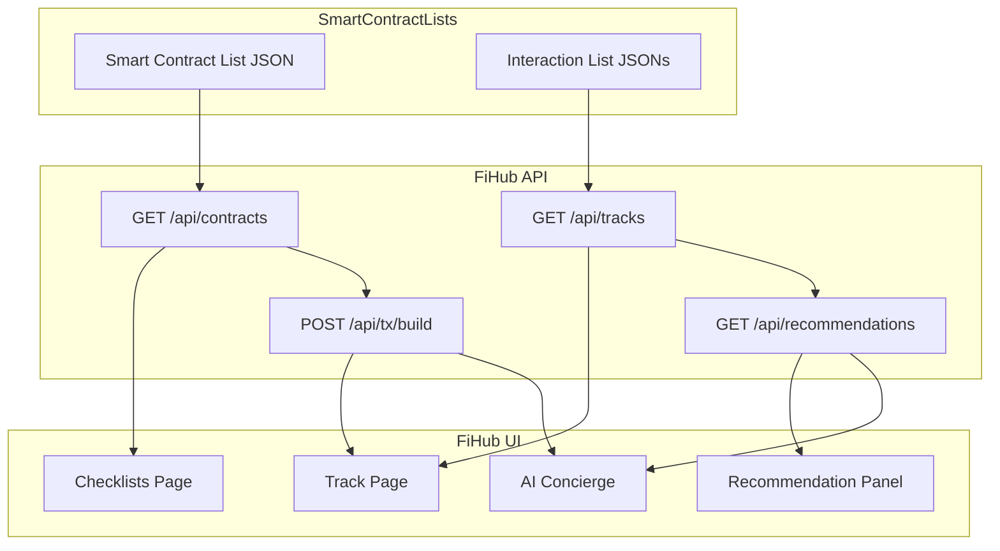

# FiHub Movement Smart Contract Lists and Interaction Lists

A **two-layer decentralized registry standard** for smart contracts and DeFi interactions on **Movement + Aptos (Move VM)**.

Inspired by the success of token lists in wallets like Uniswap, FiHub's **Smart Contract Lists (SCL)** and **Interaction Lists (IL)** extend the concept to **DeFi protocols, vaults, staking pools, AMMs, and ecosystem assets** — providing the "ecosystem map" that powers discovery, validation, AI recommendations, and safe transaction execution.

---

## Two-Layer Architecture

### Layer A: Smart Contract List (SCL) — "What exists + how risky it is"

The SCL is the canonical inventory of Move modules and their affordances: `moduleName`, `functions`, `structs`, plus rich "trust surface" metadata (audit score, governance, upgradeability, security level, compliance, interoperability).

**Schema:** [`FiHub Movement Smart Contract List Schema.json`](./FiHub%20Movement%20Smart%20Contract%20List%20Schema.json)

### Layer B: Interaction List (IL) — "What a user can do + how to do it"

The IL is a transaction/intent catalog per token/platform: interaction type, involved tokens, `module` + `function`, `entryPoint`, `gasEstimate`, and Move-specific properties (`acquires`, `resourceHandling`, `crossChain`, etc.).

**Schema:** [`FiHub Movement Interaction List Schema.json`](./FiHub%20Movement%20Interaction%20List%20Schema.json)

### Design Principle

> The AI concierge **plans from IL** (user workflows and routing) and **validates/trust-checks from SCL** (modules and truth). Everything the user can execute must be represented as an IL entry **AND** SCL module/function metadata.

---

## Current Implementation

### Smart Contract Lists

- **238 contracts** across Movement framework and ecosystem protocols
- **Comprehensive schema** with Move-native module/function/struct support
- **Automated fetcher** for real-time contract data from Movement RPC
- **Rich metadata** including audits, governance, performance, compliance
- **Surgical updates** for targeted changes without full regeneration

### Interaction Lists

- **3 tokens:** MOVE, USDC, Lost
- **20+ interaction types:** lend, borrow, vault, swap, lp, farm, stake, bridge, harvest, compound, claim, and more
- **7 platforms:** MovePosition, Layerbank, Echelon, YUZU, Mosaic, Interest DEX, Move.Fun
- **Move-native execution context:** `module`, `function`, `entryPoint`, `gasEstimate`, `moveSpecific`

---

## Canonical IDs

Both layers use canonical identifiers for consistent keying across the UI, recommendations, and AI agents:

```
module_id     = {address}::{moduleName}
function_id   = {address}::{moduleName}::{functionName}
interaction_id = hash(chainId, type, platform, module_id, functionName, tokens[])
```

---

## How It Connects to FiHub

### API Endpoints (served by `fihub/app/api/`)

| Endpoint | Source | Description |
|----------|--------|-------------|
| `GET /api/contracts?network=movement|aptos` | SCL release JSON | Full Smart Contract List for checklists and trust resolution |
| `GET /api/tracks?network=movement|aptos` | IL directory index | Available token symbols with interaction type summaries |
| `GET /api/tracks/[token]?network=movement|aptos` | IL per-token JSON | Interaction List for a specific token (e.g. MOVE, USDC, APT) |
| `GET /api/registry/search?q=...` | SCL + IL | Full-text search across contracts and interactions |
| `GET /api/opportunities?token=...` | IL + APY data | Computed opportunities (IL routes joined with yield data) |
| `POST /api/tx/build` | IL allowlist | Build tx payload — **only** registered module::function pairs allowed |

### Data Flow



### FiHub Use Cases

1. **Discovery** — Users explore curated, tagged contract lists in the FiHub Dashboard
2. **Trust & Safety** — Checklists page displays SCL validation: audit scores, governance, verification status
3. **Track Flow** — Track page uses IL to show available actions (stake, lend, LP, etc.) with module/function details
4. **Recommendations** — AI engine joins IL opportunities with portfolio and trust scores to rank suggestions
5. **Execution** — `POST /api/tx/build` validates against IL allowlist, then builds the tx payload for wallet signing
6. **Error Recovery** — `POST /api/tx/decode-error` maps Move VM errors to human-readable remediation

### Value for AI Concierge

The schemas are especially valuable for AI agents because they support **grounded reasoning**:

- Agents cite exact `module` + `function` from IL for "how to do X"
- Agents justify safety using SCL `security` + `governance` metadata
- Agents reduce hallucination by operating over a bounded registry: "Only recommend actions that exist in IL and whose modules exist in SCL"
- The `trustScore` (computed from audit + governance + verification) gates whether the agent routes to execution or only explains

---

## Smart Contract List Specification

Smart Contract Lists follow the JSON schema in [`FiHub Movement Smart Contract List Schema.json`](./FiHub%20Movement%20Smart%20Contract%20List%20Schema.json).

### Top-Level Fields

| Field | Type | Description |
|-------|------|-------------|
| `name` | string | Human-readable name (e.g. `"FiHub Movement Smart Contract List"`) |
| `logoURI` | string | URI for the list logo (PNG/SVG, 256x256 recommended) |
| `keywords` | string[] | Tags for discoverability (e.g. `["lending", "stablecoin"]`) |
| `timestamp` | string | ISO 8601 timestamp when the list was generated |
| `version` | object | Semantic versioning: `{ "major": X, "minor": Y, "patch": Z }` |
| `tags` | object | Mapping of tag identifiers to names and descriptions |
| `smartContracts` | array | Array of smart contract metadata objects |

### Smart Contract Object

Each entry inside `smartContracts` includes:

- `chainId` — Network chain ID (e.g. `1` for Movement Mainnet)
- `address` — Contract address (0x + 64 hex)
- `moduleName` — Move module name (e.g. `"lend"`, `"vault"`)
- `platform` — Platform/project name (e.g. `"MovePosition"`, `"YUZU"`)
- `name` — Human-readable contract name
- `description` — Detailed protocol description
- `website` — Official project website
- `tags` — Array of tag identifiers
- `functions` — Move function definitions with parameters, return types, visibility, entry status, and audit status
- `structs` — Move struct definitions with fields and abilities
- `security` — Audit scores, security levels, penetration testing status
- `governance` — Upgrade mechanisms, multisig requirements, timelock delays
- `compliance` — KYC/AML requirements, regulatory status
- `performance` — Gas optimization, parallel execution capabilities
- `interoperability` — Cross-chain capabilities, bridge protocols
- `apiVerification` — RPC endpoints, verification instructions, data integrity

---

## Interaction List Specification

Interaction Lists follow the JSON schema in [`FiHub Movement Interaction List Schema.json`](./FiHub%20Movement%20Interaction%20List%20Schema.json).

### Top-Level Fields

| Field | Type | Description |
|-------|------|-------------|
| `chainId` | integer | Chain ID (1 for Movement mainnet) |
| `token` | object | Primary token info: `symbol`, `address`, `platform`, `description` |
| `routes` | object | Predefined routes for common DeFi operations |
| `interactions` | array | List of available DeFi interactions |
| `platforms` | array | Information about DeFi platforms |

### Interaction Object

Each entry inside `interactions` includes:

- `type` — Interaction type: `lend`, `borrow`, `vault`, `swap`, `lp`, `farm`, `stake`, `bridge`, `harvest`, `compound`, `claim`, `strategy`, `repay`, `liquidate`, `mint`, `burn`
- `platform` — Platform providing the interaction
- `tokens` — Tokens involved (with `symbol` and `address`)
- `module` — Move module ID (e.g. `0xabc::entry_public`)
- `function` — Move function name (e.g. `lend_to_portfolio`)
- `entryPoint` — Whether the function is a transaction entry point
- `visibility` — Function visibility (`public`, `private`, `friend`)
- `gasEstimate` — Estimated gas cost
- `moveSpecific` — Move VM specific properties:
  - `acquires` — Resources acquired by the function
  - `resourceHandling` — Type of resource handling (`fungibleAsset`, `coin`, etc.)
  - `crossChainCapable` — Cross-chain support flag
  - `yieldOptimization`, `strategyManagement`, `autoCompound`, etc.

### Example (MOVE token)

```json
{
  "chainId": 1,
  "token": {
    "symbol": "MOVE",
    "address": "0x000000000000000000000000000000000000000000000000000000000000000A",
    "platform": "Movement",
    "description": "MOVE Coin is the native fungible asset of the Movement blockchain."
  },
  "routes": {
    "movePositionLending": [{ "type": "lend", "platform": "MovePosition" }],
    "yuzuSwap": [{ "type": "swap", "platform": "YUZU" }]
  },
  "interactions": [
    {
      "type": "lend",
      "platform": "MovePosition",
      "tokens": [{ "symbol": "MOVE", "address": "0x...0A" }],
      "module": "0xccd2621d...::entry_public",
      "function": "lend_to_portfolio",
      "entryPoint": true,
      "visibility": "public",
      "gasEstimate": 2000,
      "moveSpecific": {
        "resourceHandling": "fungibleAsset",
        "crossChainCapable": true
      }
    }
  ],
  "platforms": [
    {
      "name": "MovePosition",
      "description": "Cross-chain lending with intelligent leverage optimization",
      "link": "https://www.moveposition.xyz/"
    }
  ]
}
```

---

## Trust Score

FiHub computes a normalized **Trust Score (0-100)** from SCL fields for each contract:

| Factor | Points | Description |
|--------|--------|-------------|
| Base | 50 | Starting score |
| Audit score | 0-30 | Proportional to `security.auditScore` |
| Security level | 0-10 | `high` = +10, `medium` = +5 |
| Formal verification | +5 | If `security.formalVerification` is true |
| Multisig governance | +5 | If `governance.multisigRequired` is true |
| Timelock | +5 | If `governance.timelockDelay > 0` |
| Upgradeable penalty | -10 | If upgradeable without multisig or timelock |

The trust score is used by the recommendation engine and AI concierge for trust gating.

---

## Tools & Automation

### Automated Contract Fetcher

```bash
# Generate complete smart contract list from Movement RPC
python3 movement_contract_fetcher.py --networks movement_mainnet

# Generate Aptos SCL from Aptos seed list + metadata
python3 aptos_contract_fetcher.py --network aptos_mainnet

# Use custom metadata configuration
python3 movement_contract_fetcher.py --networks movement_mainnet --metadata contract_metadata.json
```

### Surgical Updates

```bash
# Sync all contracts with metadata
python3 surgical_update.py --action sync

# Update specific contract
python3 surgical_update.py --action update-contract \
  --address 0xccd2621d2897d407e06d18e6ebe3be0e6d9b61f1e809dd49360522b9105812cf \
  --module "lend" \
  --updates '{"description": "Updated description"}'

# Update all contracts for a platform
python3 surgical_update.py --action update-platform \
  --platform "MovePosition" \
  --updates '{"security": {"auditScore": 95}}'
```

### Registry Mapping Validation

```bash
# Validate IL <-> SCL mappings, routes, and protocol matrix consistency
node validate_registry_mappings.js

# Validate Aptos registry artifacts
node validate_registry_mappings.js --network aptos
```

---

## File Structure

```
SmartContractLists/
├── aptos/                                             # Aptos network-scoped artifacts
│   ├── FiHub Aptos Smart Contract List.json           # Curated Aptos SCL
│   └── Interaction List/
│       ├── APT.json
│       ├── USDC.json
│       ├── USDT.json
│       └── MOD.json
├── aptos_contract_metadata.json                       # Aptos metadata config
├── aptos_contract_fetcher.py                          # Aptos SCL fetcher (seed-driven)
├── FiHub Movement Smart Contract List Schema.json       # SCL JSON schema
├── FiHub Movement Smart Contract List.json              # Curated SCL (manual)
├── FiHub Movement Smart Contract List Generated.json    # Auto-generated SCL (238 contracts)
├── FiHub Movement Interaction List Schema.json          # IL JSON schema
├── FiHub Rapid Smart Contract List Schema.json          # Rapid/EVM SCL schema
├── FiHub Rapid Smart Contract List.json                 # EVM SCL (legacy)
├── Interaction List/                                    # IL release artifacts
│   ├── MOVE.json                                        # MOVE token interactions
│   └── USDC.json                                        # USDC token interactions
├── contract_metadata.json                               # Off-chain metadata config
├── movement_contract_fetcher.py                         # Python contract fetcher
├── movement_contract_fetcher.js                         # Node.js contract fetcher
├── surgical_update.py                                   # Targeted update tool
├── validate_registry_mappings.js                        # IL/SCL/matrix validator
├── IMPLEMENTATION_SUMMARY.md                            # Implementation details
├── docs/                                                # Move documentation & references
│   ├── aptos-protocol-addresses.json                    # Aptos protocol seed addresses
│   └── aptos-protocol-interaction-matrix.json           # Aptos protocol mapping
├── LICENSE
└── README.md                                            # This file
```

---

## Contract Coverage

### Movement Framework (4 addresses)

- **0x1** — Core framework modules (95 modules)
- **0x3** — Legacy token contracts (5 modules)
- **0x4** — Digital asset contracts (5 modules)
- **0xA** — MOVE Coin Fungible Asset

### Ecosystem Protocols (8 addresses)

| Protocol | Description | Audit |
|----------|-------------|-------|
| MovePosition | Cross-chain lending with leverage optimization | MoveBit |
| Echelon | Advanced DeFi vault with yield optimization | Team audit |
| Layerbank | Multi-layer lending with risk management | Team audit |
| Mosaic | Comprehensive DeFi protocol | MoveBit |
| Interest DEX | DEX with interest-bearing assets | Team audit |
| YUZU | DEX with concentrated liquidity | MoveBit |
| Move.Fun | Gamified DeFi with social features | MoveBit |

### Interaction Coverage

| Token | Interactions | Platforms | Types |
|-------|-------------|-----------|-------|
| MOVE | 13 | 6 | lend, borrow, vault, swap, lp, harvest, compound |
| USDC | 10 | 6 | lend, vault, compound, swap, lp |

---

## Ecosystem Mapping Pipeline

The list generation process follows a CI/CD pipeline for ecosystem understanding:

1. **Discovery** — Enumerate candidate modules from curated seed addresses
2. **Extraction** — Transform modules into raw SCL entries (functions, structs, tags)
3. **Enrichment** — Merge off-chain metadata (audits, governance, brand assets) and compute Trust Scores
4. **Mapping** — Maintain protocol-token mapping in `docs/protocol-interaction-matrix.json`
5. **Validation** — Schema validation + semantic rules + route integrity + IL↔SCL function checks
6. **Publish** — Versioned release (`raw/` for generated, `release/` for curated + validated)
7. **IL Generation/Refinement** — Bind interaction templates to SCL functions; human review; publish per-token JSONs

See:

- `docs/PROTOCOL_INTERACTION_MATRIX.md`
- `docs/protocol-interaction-matrix.json`
- `docs/APTOS_PROTOCOL_INTERACTION_MATRIX.md`
- `docs/aptos-protocol-interaction-matrix.json`
- `docs/DATA_RETRIEVAL_AND_PROCESSING.md`

---

## Version Control

- **Timestamp** — ISO 8601 for each update
- **Semantic Versioning** — Major (contract removal), Minor (contract addition), Patch (metadata changes)
- **Surgical Updates** — Patch-level targeted changes
- **Full Regeneration** — Minor-level schema rebuilds

---

## Getting Started

### Prerequisites

- Python 3.8+
- Git
- Movement Network RPC access

### Installation

```bash
# Clone the repository
git clone https://github.com/FiHub/smart-contract-lists.git
cd smart-contract-lists

# Install Python dependencies
pip install requests

# Generate the smart contract list
python3 movement_contract_fetcher.py --networks movement_mainnet
```

### Integration with FiHub

The `fihub/` application reads from this directory via its API routes:

- `GET /api/contracts` reads `FiHub Movement Smart Contract List Generated.json` (or curated)
- `GET /api/tracks/[token]` reads `Interaction List/{TOKEN}.json`
- `POST /api/tx/build` validates against the IL allowlist before building payloads

Ensure this directory exists as a sibling to `fihub/` at the workspace root.

---

## License

[MIT](LICENSE)
